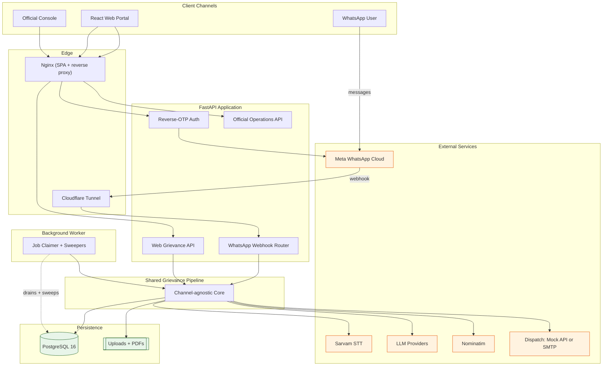
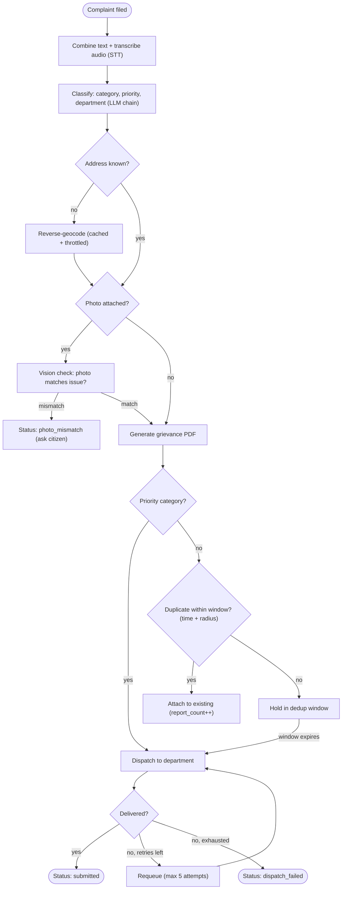
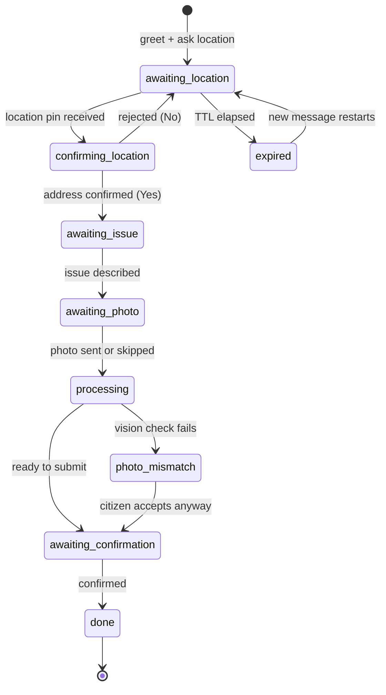
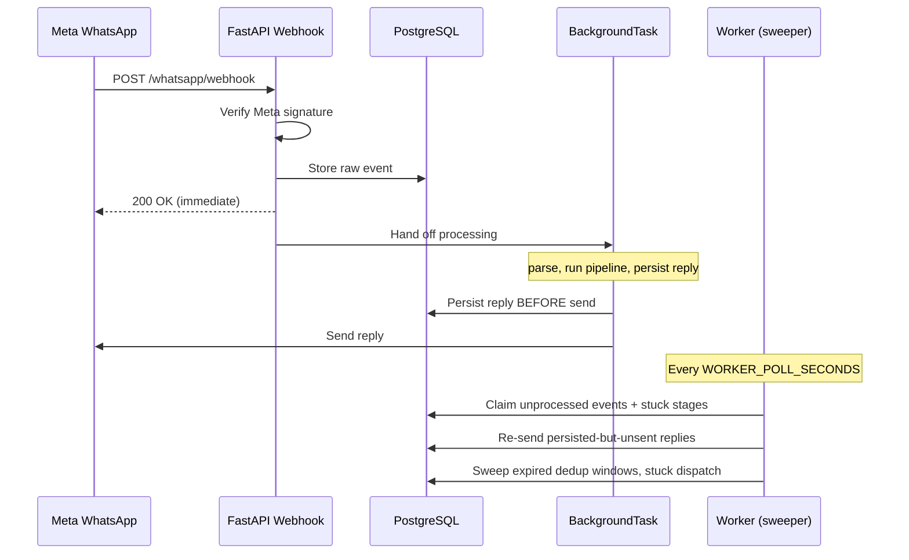
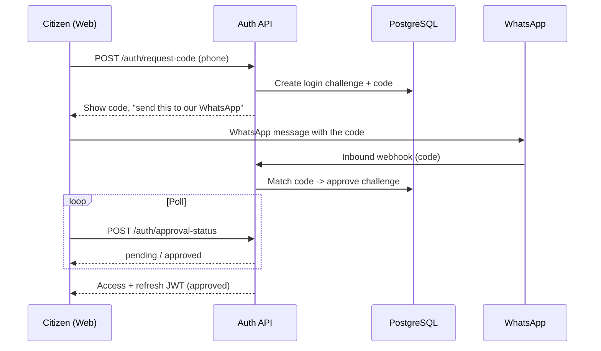
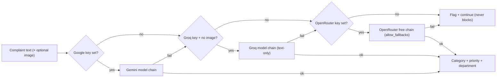
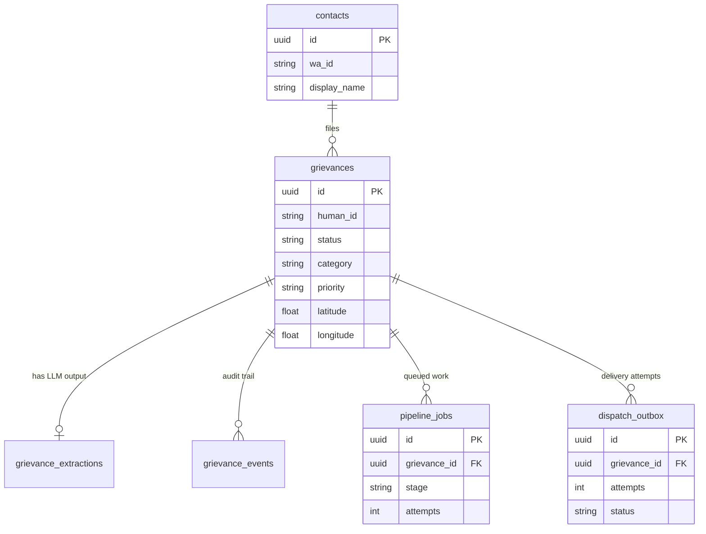
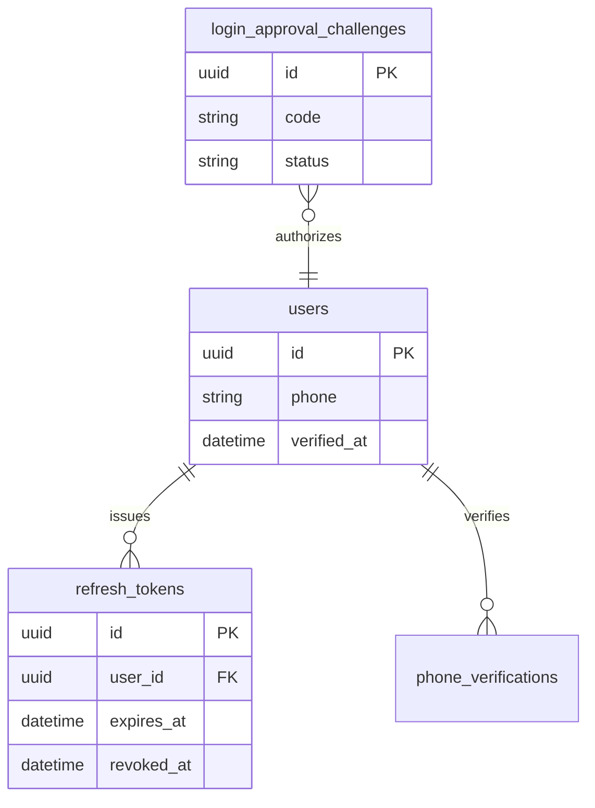

<div align="center">

<picture>
  <source media="(prefers-color-scheme: dark)" srcset="./jan-setu-logo-dark.svg" />
  
</picture>

# Jan Setu — Citizen Grievance Aggregation Platform

**A production-grade complaint pipeline that turns a WhatsApp voice note or a web form into a routed, deduplicated, and dispatched municipal grievance — automatically.**

[](#tech-stack)
[](#tech-stack)
[](#llm-fallback-chain)
[](#whatsapp-conversation-state-machine)

<br />

[](https://youtu.be/gaDLwUGXNNo)

</div>

---

## Table of Contents

- [What It Does](#what-it-does)
- [Highlights for Engineers](#highlights-for-engineers)
- [Tech Stack](#tech-stack)
- [System Architecture](#system-architecture)
- [The Grievance Processing Pipeline](#the-grievance-processing-pipeline)
- [WhatsApp Conversation State Machine](#whatsapp-conversation-state-machine)
- [Durability Model — Why Nothing Gets Lost](#durability-model--why-nothing-gets-lost)
- [Reverse-OTP Authentication](#reverse-otp-authentication)
- [LLM Fallback Chain](#llm-fallback-chain)
- [Data Model](#data-model)
- [Repository Layout](#repository-layout)
- [Getting Started](#getting-started)
- [Configuration](#configuration)
- [Testing & Quality Gates](#testing--quality-gates)
- [Deployment](#deployment)
- [Roadmap](#roadmap)
- [Author](#author)
- [Acknowledgments](#acknowledgments)
- [License](#license)

---

## What It Does

Jan Setu (Hindi: *"people's bridge"*) lets a citizen file a civic complaint the way they already communicate — a WhatsApp voice note in their own language, or a mobile web form — and does the rest without a human in the loop:

1. **Transcribes** voice notes (Sarvam AI, multilingual) into text.
2. **Classifies** the complaint into a department category using a multi-provider LLM chain with automatic failover.
3. **Geocodes** the location, reverse-resolving GPS coordinates to a human address (cached + globally throttled).
4. **Verifies** attached photos actually match the reported issue (vision model).
5. **Deduplicates** against nearby recent complaints inside a configurable time/space window.
6. **Generates** a formatted PDF grievance summary.
7. **Dispatches** the complaint to the responsible department via a municipal API or email, with bounded retries.

Both intake channels — WhatsApp and web — feed **one shared, channel-agnostic pipeline**, so behaviour never drifts between them.

---

## Highlights for Engineers

The parts worth reading the code for:

| Concern | How it's solved |
| --- | --- |
| **Durability** | Webhooks are acknowledged in `<200 ms`, then processed off the request path. A background worker re-drains any event a crashed request missed, sweeps stuck pipeline stages, and re-sends replies persisted-but-never-sent. |
| **Exactly-once** | Each inbound WhatsApp message is consumed once via `fsm_message_consumptions`; replies are persisted **before** send, so a crash mid-flight never drops *or* duplicates a message. |
| **Graceful degradation** | Every pipeline stage degrades instead of blocking — a failed STT, LLM, or geocode leaves a flag on the grievance and continues. A citizen's complaint is never lost to a flaky free-tier API. |
| **Provider failover** | Classification walks an ordered chain (Google Gemini → Groq → OpenRouter) with per-provider rate limiting; image-bearing prompts skip text-only providers automatically. |
| **Global throttling** | Third-party quotas (Nominatim 1 req/s, Sarvam, per-LLM) are enforced across all workers via an `external_rate_limits` table, with results memoised in `geocode_cache`. |
| **Bounded retries** | Dispatch attempts cap at `MAX_DISPATCH_ATTEMPTS = 5` before a grievance is marked `dispatch_failed` for human follow-up. |
| **Fail-closed security** | `insecure_production_defaults()` warns at startup; a dev-only `JWT_SECRET` is *rejected* outside development; CORS is narrowed to the exact verbs/headers the app uses, not `*`. |
| **Deterministic schema** | Alembic migrations with an explicit naming convention, plus an `alembic check` CI job that fails on model/migration drift. |

---

## Tech Stack

**Backend**


**Frontend**


**Data & Infrastructure**


**AI & External Services**


-1A73E8?logoColor=white)


**Tooling & QA**


> Backend also uses Alembic migrations, fpdf2 (PDF generation), and Pillow (image handling); the frontend ships a custom i18n layer covering 6 languages.

---

## System Architecture

Two intake channels, one pipeline, one durability net.



---

## The Grievance Processing Pipeline

The heart of the system (`src/jan_setu/pipeline/core.py`). Both channels call these same functions, so *"what happens to a filed complaint"* has exactly one implementation. Every stage degrades rather than blocks.



> **Priority categories skip the dedup window** and dispatch immediately — a burst water main shouldn't wait behind a 24-hour deduplication hold.

---

## WhatsApp Conversation State Machine

Inbound WhatsApp messages drive a guided dialog implemented as a **pure finite-state machine** (`src/jan_setu/whatsapp/conversation.py`) — no I/O, so every transition is unit-testable without a database. State persists in the `conversations` table.



---

## Durability Model — Why Nothing Gets Lost

The single most important design decision in the codebase: **the request path is fast and disposable; the worker is the durability net.**



Returning `200` immediately means slow processing never triggers Meta's webhook retries. If the API restarts mid-flight, the worker re-drains whatever the `BackgroundTask` never finished — idempotently. `worker-dev` runs beside the host API in the `dev` profile; `worker` runs beside the containerized API in `prod`.

---

## Reverse-OTP Authentication

Rather than *sending* an OTP to the citizen (SMS costs, deliverability, spoofing), Jan Setu inverts it: the citizen is shown a code and **sends it to the Jan Setu WhatsApp Business number**. Possession of the WhatsApp account *is* the proof.



JWTs are short-lived access (15 min) + rotating refresh (30 days). A dev-only `JWT_SECRET` is rejected at startup outside development. Officials use a separate challenge-based login (`/api/official/auth/*`) with its own audit trail.

---

## LLM Fallback Chain

Classification and image-matching never depend on a single provider. Attempts walk an ordered chain; a rate-limit or error on one provider falls through to the next.



Image-bearing prompts skip Groq (text-only) automatically. Each provider carries its own `min_interval` throttle enforced through the shared rate-limit table.

---

## Data Model

22 tables managed by Alembic. The two cores worth showing:

**Grievance lifecycle**



**Identity & sessions**



Model definitions live in `src/jan_setu/db/models.py`. `Base.metadata` uses a naming convention so constraint and index names are deterministic across environments.

---

## Repository Layout

```
Jan-Setu/
├── src/jan_setu/
│   ├── app.py                 # FastAPI app factory, middleware, CORS, request logging
│   ├── main.py                # API entrypoint (uv run jan-setu-api)
│   ├── worker.py              # Background worker / durability net (uv run jan-setu-worker)
│   ├── config.py              # Pydantic Settings — all env vars, fail-closed checks
│   ├── auth.py                # Reverse-OTP citizen authentication
│   ├── officials.py           # Official console operations + audit
│   ├── pipeline/              # Channel-agnostic grievance pipeline
│   │   ├── core.py            # transcribe -> classify -> geocode -> image -> pdf -> dispatch
│   │   ├── classify.py        # Multi-provider LLM chain
│   │   ├── stt.py             # Sarvam speech-to-text
│   │   ├── geocoding.py       # Nominatim + cache + throttle
│   │   ├── dedup.py           # Time/space deduplication window
│   │   ├── dispatchers.py     # Mock API + SMTP delivery
│   │   └── pdfgen.py          # Grievance PDF summary
│   ├── whatsapp/              # WhatsApp Cloud API channel
│   │   ├── conversation.py    # Pure FSM (no I/O)
│   │   ├── processing.py      # Webhook -> pipeline seam
│   │   └── client.py          # Meta Graph API client
│   ├── web/api.py             # Web portal grievance API
│   ├── repositories/          # Data-access layer (one module per aggregate)
│   └── db/models.py           # SQLAlchemy models
├── frontend/                  # React 18 + TypeScript + Vite citizen portal
│   └── src/{pages,components,api,auth,i18n}
├── migrations/                # Alembic versions
├── tests/                     # pytest suite
├── docker-compose.yml         # dev + prod profiles
└── Dockerfile                 # uv-based Python 3.11 image
```

---

## Getting Started

### Prerequisites

| Workflow | Needs |
| --- | --- |
| Full Docker demo | Docker Desktop only |
| Daily development | Docker Desktop · Python 3.11+ · Node 20+ · [`uv`](https://docs.astral.sh/uv/) |

Secrets are managed with [Doppler](https://www.doppler.com/) — no `.env` file needs to live on disk. A committed `.env.example` documents every variable, and a plain `.env` file still works as a fallback.

### Quick Start — Full Stack in Docker

```sh
git clone https://github.com/tushar-mahalya/Jan-Setu.git
cd Jan-Setu

# With Doppler (recommended): --mount writes a temporary .env for the run only.
doppler run --mount .env -- docker compose --profile prod up -d --build
doppler run --mount .env -- docker compose exec -T api uv run alembic upgrade head

# Or with a local .env file:
#   cp .env.example .env
#   docker compose --profile prod up -d --build
#   docker compose exec -T api uv run alembic upgrade head
```

| Service | URL |
| --- | --- |
| Citizen web app | http://localhost:8080 |
| API docs (Swagger) | http://localhost:8000/docs |
| Mailpit inbox | http://localhost:8025 |
| Health check | http://localhost:8000/health |

### Daily Development Workflow

Background services in Docker; API and frontend on the host for hot reload.

```sh
sh scripts/setup-dev.sh          # installs deps + git hooks (the only supported setup path)

# 1. Docker: PostgreSQL + worker-dev + Mailpit
doppler run --mount .env -- docker compose --profile dev up -d --build

# 2. Apply schema
doppler run -- uv run alembic upgrade head
```

Then two terminals:

```sh
# Terminal 1 — FastAPI with reload
doppler run -- uv run jan-setu-api
```

```sh
# Terminal 2 — Vite dev server (public config only; no secrets needed)
npm --prefix frontend run dev
```

| What | URL |
| --- | --- |
| Web app | http://localhost:5173 |
| API docs | http://localhost:8000/docs |
| Mailpit | http://localhost:8025 |

> **Why the flags differ:** Docker Compose's `env_file:` hard-requires a real file, so it needs `doppler run --mount`. The backend reads config through `pydantic-settings`, which pulls from the process environment `doppler run` already injects. The frontend only consumes public `VITE_*` values with working defaults, so plain `npm` is fine. Drop `doppler run` and use `.env` if you prefer a file.

### Everyday Commands

```sh
doppler run -- uv run pytest                 # test suite
doppler run -- uv run ruff check .           # lint
doppler run -- uv run alembic upgrade head   # migrate
doppler run -- uv run pre-commit run --all-files

docker compose --profile dev logs -f worker-dev   # watch worker
docker compose --profile dev down                 # stop, keep data
docker compose --profile dev down -v              # stop, DELETE all local data
```

After changing a model, generate and **review** a migration:

```sh
doppler run -- uv run alembic revision --autogenerate -m "describe change"
doppler run -- uv run alembic check          # fails on model/migration drift (also runs in CI)
```

---

## Configuration

All settings are typed in `src/jan_setu/config.py`. Key groups:

| Group | Variables |
| --- | --- |
| **Database** | `POSTGRES_HOST` `POSTGRES_PORT` `POSTGRES_DB` `POSTGRES_USER` `POSTGRES_PASSWORD` · or a single `DATABASE_URL` |
| **WhatsApp** | `WHATSAPP_VERIFY_TOKEN` `WHATSAPP_APP_SECRET` `WHATSAPP_ACCESS_TOKEN` `WHATSAPP_PHONE_NUMBER_ID` `WHATSAPP_GRAPH_API_VERSION` `PUBLIC_WA_NUMBER` |
| **Worker** | `AUTO_REPLY_ENABLED` `WORKER_POLL_SECONDS` `WORKER_BATCH_SIZE` |
| **STT** | `SARVAM_API_KEY` `SARVAM_MODEL` `SARVAM_BASE_URL` |
| **LLM** | `GOOGLE_API_KEY` `GOOGLE_MODELS` · `GROQ_API_KEY` `GROQ_MODELS` · `OPENROUTER_API_KEY` `OPENROUTER_MODELS` (each with `*_MIN_INTERVAL_SECONDS`) |
| **Geocoding** | `GEOCODER_PROVIDER` `NOMINATIM_BASE_URL` `NOMINATIM_USER_AGENT` `GEOCODER_LANGUAGE` |
| **Dedup** | `DEDUP_WINDOW_HOURS` `DEDUP_RADIUS_M` `IMAGE_RECHECK_CAP` |
| **Dispatch** | `DISPATCHER` (`mock_api` \| `smtp`) · `SMTP_HOST` `SMTP_PORT` `SMTP_FROM` `SMTP_USERNAME` `SMTP_PASSWORD` |
| **Auth / security** | `JWT_SECRET` (≥32 bytes; dev value rejected in prod) `ACCESS_TOKEN_MINUTES` `REFRESH_TOKEN_DAYS` `API_KEY` `CORS_ORIGINS` |

> **Production geocoding note:** the default Nominatim endpoint is **DEV-ONLY** (OpenStreetMap policy caps it at 1 req/s and forbids bulk traffic). For production, point `NOMINATIM_BASE_URL` at a self-hosted Nominatim/Photon or a paid provider, and keep an identifying `NOMINATIM_USER_AGENT`.

---

## Testing & Quality Gates

```sh
doppler run -- uv run pytest                 # backend suite, coverage gate at 85%
npm --prefix frontend test                   # Vitest component tests
npm --prefix frontend run test:e2e           # Playwright E2E
```

- **Backend** — pytest with an `--cov-fail-under=85` ratchet; the FSM's pure transition logic is exhaustively unit-tested with no DB.
- **Frontend** — Vitest + React Testing Library for components, Playwright for browser flows.
- **CI** (`.github/workflows/ci.yml`) — three parallel jobs on every PR and push to `main`:
  - **lint** — pre-commit (Ruff lint + format + hygiene hooks)
  - **test** — the pytest suite
  - **migrations** — applies migrations to a clean Postgres and runs `alembic check` to catch model/migration drift

  A `ci-success` job aggregates them; require **`CI success`** in branch protection.

---

## Deployment

- **Local production-like demo** — `docker compose --profile prod up` builds the full containerized stack: PostgreSQL, API, worker, and the frontend served by Nginx (which also reverse-proxies `/api` and `/auth`, serves SPA deep links, and sets immutable caching on content-hashed assets).
- **Live dev instance** — `main` auto-deploys to an Oracle Cloud "Always Free" Ampere VM via `.github/workflows/deploy-dev.yml` once CI passes: SSH in, `git reset --hard`, rebuild the stack, migrate. Mailpit and the temporary tunnel are excluded — the VM uses OCI Email Delivery (real SMTP) and its own long-lived Cloudflare Tunnel started outside Compose so redeploys never touch the webhook URL.
- **WhatsApp webhook** — the `dev` profile starts a temporary Cloudflare tunnel; `docker compose --profile dev logs -f tunnel` prints the public URL to register in Meta's portal as `https://<url>.trycloudflare.com/whatsapp/webhook` (verify token = `WHATSAPP_VERIFY_TOKEN`).

The `prod` profile is a local demonstration recipe, **not** an Azure/cloud deployment manifest — a real deployment swaps local PostgreSQL and Mailpit for managed equivalents and never exposes the database or worker ports.

---

## Roadmap

- [ ] Official analytics dashboard (SLA breach alerts, per-department load)
- [ ] Self-hosted Nominatim/Photon for production-grade geocoding
- [ ] Additional dispatch adapters (webhook, ticketing systems)
- [ ] Push-notification status updates to citizens on WhatsApp
- [ ] Horizontal worker scaling with partitioned job claiming

---

## Author

**Tushar Sharma** ([@tushar-mahalya](https://github.com/tushar-mahalya))

- GitHub: [github.com/tushar-mahalya](https://github.com/tushar-mahalya)
- Email: [tusharmahalya@gmail.com](mailto:tusharmahalya@gmail.com)

---

## Acknowledgments

- [FastAPI](https://fastapi.tiangolo.com/) & [SQLAlchemy](https://www.sqlalchemy.org/) for the async backend foundation
- [Meta WhatsApp Cloud API](https://developers.facebook.com/docs/whatsapp/cloud-api) for the messaging channel
- [Sarvam AI](https://www.sarvam.ai/) for multilingual speech-to-text
- [Google Gemini](https://ai.google.dev/), [Groq](https://groq.com/), and [OpenRouter](https://openrouter.ai/) for the LLM classification chain
- [OpenStreetMap Nominatim](https://nominatim.org/) for reverse geocoding
- [Leaflet](https://leafletjs.com/) for interactive maps
- [Oracle Cloud](https://www.oracle.com/cloud/free/) & [Cloudflare](https://www.cloudflare.com/) for free-tier hosting and tunneling

---

## License

Licensed under the **Apache License 2.0** — see [LICENSE](./LICENSE) and [NOTICE](./NOTICE).

You are free to use, modify, and distribute this software under the terms of Apache 2.0, which requires you to retain the copyright and [NOTICE](./NOTICE) attribution, state any changes, and include a copy of the license. For inquiries, contact [tusharmahalya@gmail.com](mailto:tusharmahalya@gmail.com).

---

<div align="center">

**Jan Setu** — © 2026 Tushar Sharma · Licensed under Apache 2.0

</div>
